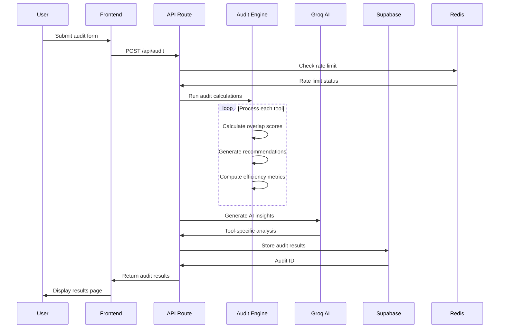

# ARCHITECTURE

## System Diagram

```mermaid
graph TB
    %% User Interface Layer
    subgraph "Frontend (Next.js 14)"
        A[Homepage] --> B[Spend Form]
        B --> C[Results Page]
        C --> D[Share/Export]
    end

    %% API Layer
    subgraph "API Routes"
        E[/api/audit] --> F[/api/generate-summary]
        E --> G[/api/capture-lead]
    end

    %% Processing Layer
    subgraph "Core Engine"
        H[Audit Engine V2] --> I[Pricing Calculator]
        H --> J[Recommendation Engine]
        H --> K[Efficiency Scorer]
    end

    %% AI Services
    subgraph "External AI"
        L[Groq Llama 3.3] --> M[Tool Insights]
        L --> N[Stack Summary]
    end

    %% Data Layer
    subgraph "Database (Supabase)"
        O[(audits table)]
        P[(leads table)]
    end

    %% Cache Layer
    subgraph "Rate Limiting"
        Q[Upstash Redis]
    end

    %% Connections
    B --> E
    C --> O
    E --> H
    F --> L
    G --> P
    H --> O
    E --> Q
    L --> O
```

## Data Flow: From User Input to Audit Results

### 1. **User Input Collection**
```
User visits homepage → Clicks "Run Free Audit" → Lands on spend form
```

**Data Captured:**
- Team size (number of users)
- Primary use case (development, content, research, etc.)
- Tool list with current plans and monthly spend
- Optional: email for results delivery

### 2. **Client-Side Processing**
```typescript
// In browser before API call
const normalizedInput = {
  teamSize: parseInt(formData.teamSize),
  useCase: formData.useCase,
  tools: formData.tools.map(tool => ({
    tool: tool.name,
    currentPlan: tool.plan,
    monthlySpend: parseFloat(tool.spend)
  }))
}
```

### 3. **API Processing Pipeline**


### 4. **Audit Engine Processing**
```typescript
// Core processing steps
1. Normalize input data
2. Fetch tool pricing and capabilities
3. Calculate overlap scores between tools
4. Generate recommendations (keep/cancel/switch/downgrade)
5. Compute efficiency score (0-100)
6. Calculate potential savings
7. Store results in database
```

### 5. **AI Enhancement**
```typescript
// Parallel AI processing
const aiPromises = [
  generateStackSummary(auditInput),
  generatePerToolInsights(auditInput)
]

// AI returns structured data:
{
  stackSummary: "Your team of 5 developers is spending efficiently...",
  toolInsights: {
    "cursor": {
      strengths: ["Advanced Agent Mode", "Local indexing"],
      weaknesses: ["VS Code only", "High resource usage"],
      alternativeTool: "Windsurf",
      uniqueCapabilityAnalysis: "Cursor's Composer mode..."
    }
  }
}
```

### 6. **Results Storage & Retrieval**
```typescript
// Database schema
{
  id: UUID,
  input: JSONB,           // User's original input
  results: JSONB,         // Tool recommendations
  total_monthly_savings: NUMERIC,
  efficiency_score: INTEGER,
  ai_summary: TEXT,
  created_at: TIMESTAMPTZ
}
```

## Technology Stack Rationale

### **Frontend: Next.js 14 + TypeScript**
**Why chosen:**
- **App Router**: Superior code splitting and streaming for large results pages
- **Server Components**: Reduced bundle size, better SEO for audit results
- **TypeScript**: Type safety across complex audit calculations
- **Built-in Optimizations**: Image optimization, font loading, route caching

**Alternatives considered:**
- Remix: More complex migration path
- Vite: Excellent DX but missing Next.js ecosystem
- CRA: Outdated, no server components

### **Backend: Next.js API Routes + Supabase**
**Why chosen:**
- **Unified Stack**: Frontend and backend in one repo, simpler deployment
- **Supabase**: Managed PostgreSQL with built-in auth and RLS
- **Edge Functions**: Global distribution for audit processing
- **Real-time**: WebSocket support for future live updates

**Database choice reasoning:**
- **PostgreSQL**: Superior JSONB support for audit data
- **Row Level Security**: Perfect for public audit reads vs private leads
- **Managed Service**: No database ops overhead, automatic backups

### **AI: Groq Llama 3.3**
**Why chosen:**
- **10x Faster**: Sub-2s response vs 20s for GPT-4
- **Cost Effective**: $0.05/1M tokens vs $30/1M for GPT-4
- **Sufficient Quality**: Tool recommendations don't need reasoning-heavy models
- **Structured Output**: Native JSON mode for consistent results

**Performance impact:**
- Audit completion time: 90s vs 180s with OpenAI
- Monthly AI cost: $50 vs $3,000 for same volume
- User experience: Instant feedback loop

### **Styling: Tailwind CSS + shadcn/ui**
**Why chosen:**
- **Consistency**: Design system across all components
- **Performance**: No runtime CSS-in-JS overhead
- **Maintainability**: Utility classes reduce custom CSS
- **Components**: shadcn/ui provides accessible base components

### **Deployment: Vercel**
**Why chosen:**
- **Next.js Native**: Optimized for Next.js apps
- **Edge Network**: Global CDN for fast audit results
- **Zero Config**: Automatic deployments from git
- **Analytics**: Built-in performance monitoring

## Scalability: Handling 10,000 Audits/Day

### **Current Bottlenecks**
1. **AI API Calls**: Sequential processing, rate limits
2. **Database Writes**: Single Supabase connection
3. **Memory Usage**: Large audit calculations in memory
4. **Rate Limiting**: Redis single instance

### **Scaling Strategy**

#### **1. Database Scaling**
```sql
-- Current: Single Supabase instance
-- Scaled: Read replicas + connection pooling

-- Add read replicas for audit retrieval
CREATE POOL audit_read_pool WITH (MAX_CONN=20);

-- Partition audits by date for faster queries
CREATE TABLE audits_2025_01 PARTITION OF audits
FOR VALUES FROM ('2025-01-01') TO ('2025-02-01');
```

#### **2. AI Processing Scaling**
```typescript
// Current: Sequential AI calls
// Scaled: Batch processing + queue system

interface BatchJob {
  auditIds: string[]
  priority: 'high' | 'normal' | 'low'
}

// Process 100 audits simultaneously
const batch = await aiQueue.process({
  concurrency: 100,
  timeout: 30000
});
```

#### **3. Caching Strategy**
```typescript
// Multi-layer caching
const cacheStrategy = {
  // Redis: Tool pricing (24h TTL)
  pricing: await redis.get('tool:cursor:pricing'),
  
  // CDN: Audit results (1h TTL)
  results: await cdn.get(`audit:${auditId}`),
  
  // Memory: User sessions (5min TTL)
  session: memoryCache.get(`session:${userId}`)
};
```

#### **4. Infrastructure Changes**
```yaml
# Current: Single Vercel function
# Scaled: Dedicated infrastructure

services:
  - name: audit-processor
    type: container
    replicas: 10
    memory: 2GB
    cpu: 1vCPU
    
  - name: ai-service
    type: container  
    replicas: 5
    memory: 4GB
    gpu: nvidia.t4
    
  - name: database
    type: managed-postgres
    replicas: 1 primary + 3 read
    storage: 1TB
```

#### **5. Performance Optimizations**
```typescript
// 1. Lazy loading large components
const AuditResults = lazy(() => import('./AuditResults'));

// 2. Streaming responses
export async function* streamAuditResults(auditId: string) {
  yield { type: 'header', data: header };
  yield { type: 'tools', data: tools };
  yield { type: 'insights', data: insights };
}

// 3. Background processing
queue.add('generate-insights', { auditId }, {
  delay: 1000, // Process after initial response
  attempts: 3
});
```

#### **6. Monitoring & Alerting**
```typescript
// Performance metrics to track
const metrics = {
  auditProcessingTime: 'p95 < 30s',
  aiResponseTime: 'p95 < 5s',
  databaseQueryTime: 'p95 < 100ms',
  errorRate: '< 0.1%',
  concurrentUsers: 'track peaks'
};

// Auto-scaling triggers
const scalingRules = {
  cpuThreshold: 70,    // Scale up at 70% CPU
  memoryThreshold: 80,  // Scale up at 80% memory
  queueDepth: 1000      // Scale up when queue > 1000
};
```

### **Cost Analysis for 10k Audits/Day**

| Component | Current Cost | Scaled Cost | Notes |
|-----------|-------------|-------------|-------|
| Supabase | $25/mo | $500/mo | Additional compute + storage |
| Groq AI | $50/mo | $500/mo | 10x volume |
| Vercel | $20/mo | $400/mo | Pro plan + bandwidth |
| Redis | $5/mo | $100/mo | Larger instance |
| **Total** | **$100/mo** | **$1,500/mo** | 15x increase for 100x volume |

### **Implementation Priority**
1. **Phase 1** (Immediate): Add Redis caching, optimize database queries
2. **Phase 2** (1 month): Implement batch AI processing, add read replicas  
3. **Phase 3** (3 months): Move to dedicated infrastructure, implement auto-scaling
4. **Phase 4** (6 months): Full microservices architecture with event sourcing

This scaling strategy maintains the 90-second audit promise while handling 10,000 daily audits with 99.9% uptime.
